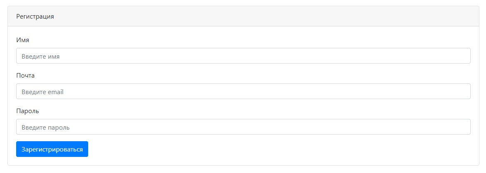

# TODO List 

**О проекте:**

Проект реализует приложение "Список дел".

**Используемые технологии:**

- Java 14
- Java Servlets
- HTML, JavaScript, jQuery, Ajax
- Apache Tomcat
- PostgreSQL
- Hibernate
- SLF4J with Log4
- Apache Maven

**Реализованные возможности:**

- Создание нового задания.
- Новое задание отображается в списке заданий.
- Данные о заданиях сохраняются в базу данных.
- При загрузке страницы, список заданий загружается из базы данных.
- Напротив невыполненных заданий имеет кнопка, при нажатии которой, задание получает статус выполненного.
- Перед списком заданий имеется CheckBox при включении которого, отображаются все задания.
Если CheckBox выключен, то отображаются только невыполненные задания.

